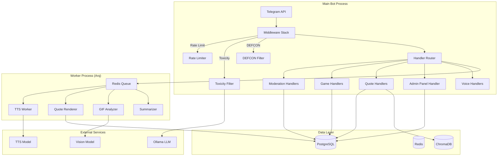
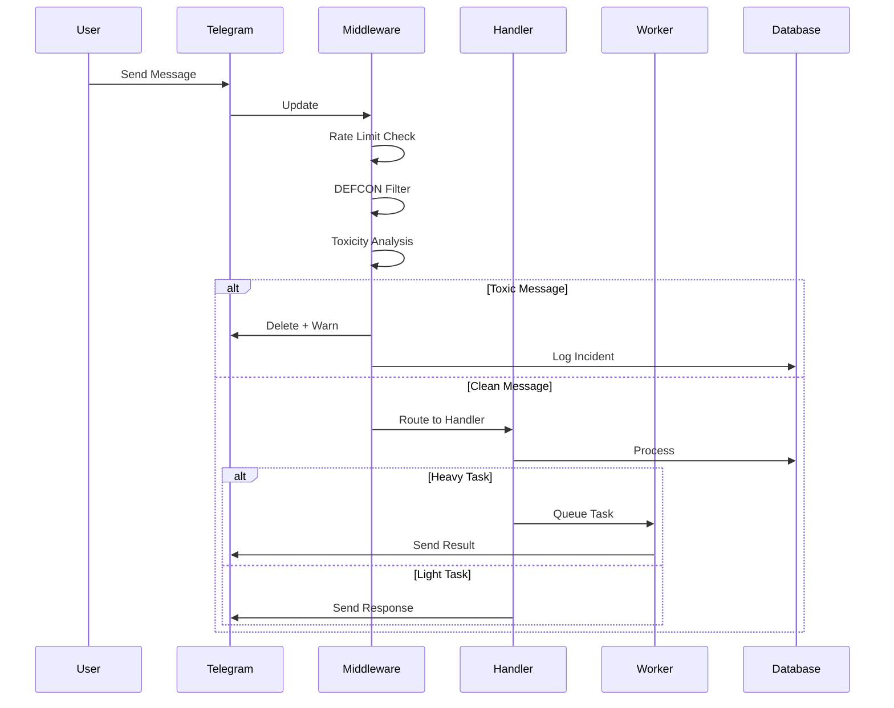

# Design Document: OLEG v6.0 Fortress Update

## Overview

OLEG v6.0 Fortress Update transforms the Telegram bot into a comprehensive chat protection system with AI-powered moderation, voice technologies, enhanced quote system, tournament mechanics, and live UI feedback. The architecture follows a microservices pattern with a main bot process handling real-time interactions and a Worker process for heavy computational tasks.

### Key Design Principles

1. **Defense in Depth**: Multiple layers of protection (DEFCON system) that can be adjusted based on threat level
2. **AI-First Moderation**: Context-aware toxicity detection using LLM instead of simple keyword matching
3. **Async Heavy Tasks**: TTS, quote rendering, and GIF analysis offloaded to Worker process
4. **Owner-Centric Control**: All settings manageable through private admin panel
5. **Security by Default**: Input sanitization, rate limiting, and HMAC-signed callbacks

## Architecture



### Component Interaction Flow



## Components and Interfaces

### 1. Citadel System (DEFCON Protection)

```python
class DEFCONLevel(Enum):
    PEACEFUL = 1      # Anti-spam links + basic captcha
    STRICT = 2        # + Profanity filter, sticker limit, forward block
    MARTIAL_LAW = 3   # + Full media restriction for new users, Hard Captcha

@dataclass
class CitadelConfig:
    chat_id: int
    defcon_level: DEFCONLevel
    raid_mode_until: Optional[datetime]
    anti_spam_enabled: bool
    profanity_filter_enabled: bool
    sticker_limit: int  # 0 = disabled
    forward_block_enabled: bool
    new_user_restriction_hours: int
    hard_captcha_enabled: bool

class CitadelService:
    async def get_config(self, chat_id: int) -> CitadelConfig
    async def set_defcon(self, chat_id: int, level: DEFCONLevel) -> None
    async def activate_raid_mode(self, chat_id: int, duration_minutes: int = 15) -> None
    async def check_raid_condition(self, chat_id: int) -> bool
    async def is_new_user(self, user_id: int, chat_id: int) -> bool
```

### 2. Neuro-Moderation System

```python
@dataclass
class ToxicityResult:
    score: int  # 0-100
    category: Optional[str]  # insult, hate_speech, threat, spam
    confidence: float  # 0.0-1.0
    is_sarcasm: bool
    raw_response: str

class NeuroModerationService:
    async def analyze_toxicity(self, text: str) -> ToxicityResult
    async def get_action_for_score(
        self, score: int, defcon_level: DEFCONLevel
    ) -> ModerationAction
    async def log_incident(
        self, chat_id: int, user_id: int, text: str, result: ToxicityResult, action: str
    ) -> None
```

### 3. GIF Patrol System

```python
@dataclass
class GIFAnalysisResult:
    is_safe: bool
    detected_categories: List[str]  # pornography, screamer, violence
    confidence: float
    frame_results: List[FrameAnalysis]

class GIFPatrolService:
    async def extract_frames(self, gif_data: bytes) -> List[bytes]  # 3 frames
    async def analyze_frame(self, frame: bytes) -> FrameAnalysis
    async def analyze_gif(self, gif_data: bytes) -> GIFAnalysisResult
    async def queue_analysis(self, message_id: int, chat_id: int, file_id: str) -> str
```

### 4. Reputation System

```python
class ReputationChange(Enum):
    WARNING = -50
    MUTE = -100
    MESSAGE_DELETED = -10
    THANK_YOU = +5
    TOURNAMENT_WIN = +20

@dataclass
class ReputationStatus:
    score: int
    is_read_only: bool
    recent_changes: List[Tuple[datetime, int, str]]

class ReputationService:
    async def get_reputation(self, user_id: int, chat_id: int) -> ReputationStatus
    async def modify_reputation(
        self, user_id: int, chat_id: int, change: int, reason: str
    ) -> ReputationStatus
    async def check_read_only_status(self, user_id: int, chat_id: int) -> bool
    async def initialize_user(self, user_id: int, chat_id: int) -> None
```

### 5. TTS Service

```python
@dataclass
class TTSResult:
    audio_data: bytes
    duration_seconds: float
    format: str  # ogg

class TTSService:
    async def generate_voice(self, text: str, max_chars: int = 500) -> TTSResult
    async def should_auto_voice(self) -> bool  # 0.1% chance
    async def queue_tts_task(self, text: str, chat_id: int, reply_to: int) -> str
```

### 6. Summarizer Service

```python
@dataclass
class SummaryResult:
    summary: str
    original_length: int
    is_too_short: bool
    source_type: str  # message, article, forwarded

class SummarizerService:
    async def summarize(self, content: str, style: str = "oleg") -> SummaryResult
    async def fetch_article(self, url: str) -> Optional[str]
    async def summarize_with_voice_option(
        self, content: str, chat_id: int, message_id: int
    ) -> Tuple[SummaryResult, Optional[InlineKeyboardMarkup]]
```

### 7. Quote Generator

```python
@dataclass
class QuoteStyle:
    theme: str  # dark, light, auto
    gradient: Optional[Tuple[str, str]]
    font_family: str
    avatar_style: str

@dataclass
class QuoteImage:
    image_data: bytes
    format: str  # webp
    width: int
    height: int

class QuoteGeneratorService:
    async def render_quote(
        self, text: str, username: str, avatar_url: Optional[str], style: QuoteStyle
    ) -> QuoteImage
    async def render_quote_chain(
        self, messages: List[Message], style: QuoteStyle
    ) -> QuoteImage
    async def render_roast_quote(
        self, text: str, username: str, avatar_url: Optional[str], style: QuoteStyle
    ) -> QuoteImage
    async def generate_roast_comment(self, text: str) -> str
```

### 8. Sticker Pack Manager

```python
@dataclass
class StickerPackInfo:
    name: str
    title: str
    sticker_count: int
    is_full: bool

class StickerPackService:
    async def get_current_pack(self, chat_id: int) -> StickerPackInfo
    async def add_sticker(self, chat_id: int, image_data: bytes, emoji: str) -> str
    async def remove_sticker(self, file_id: str) -> bool
    async def create_new_pack(self, chat_id: int) -> StickerPackInfo
    async def rotate_pack_if_needed(self, chat_id: int) -> Optional[StickerPackInfo]
```

### 9. Golden Fund Service

```python
class GoldenFundService:
    async def check_and_promote(self, quote_id: int, reaction_count: int) -> bool
    async def search_relevant_quote(self, context: str, limit: int = 5) -> Optional[Quote]
    async def should_respond_with_quote(self) -> bool  # 5% chance
    async def get_golden_quotes(self, chat_id: int, limit: int = 10) -> List[Quote]
```

### 10. Tournament System

```python
class TournamentType(Enum):
    DAILY = "daily"
    WEEKLY = "weekly"
    GRAND_CUP = "grand_cup"

class TournamentDiscipline(Enum):
    GROW = "grow"
    PVP = "pvp"
    ROULETTE = "roulette"

@dataclass
class TournamentStanding:
    user_id: int
    username: str
    score: int
    rank: int

class TournamentService:
    async def start_tournament(self, type: TournamentType) -> Tournament
    async def end_tournament(self, tournament_id: int) -> List[TournamentStanding]
    async def update_score(
        self, user_id: int, discipline: TournamentDiscipline, delta: int
    ) -> None
    async def get_standings(
        self, tournament_id: int, discipline: TournamentDiscipline
    ) -> List[TournamentStanding]
```

### 11. League System (ELO)

```python
class League(Enum):
    SCRAP = ("🥉", 0, 1199)
    SILICON = ("🥈", 1200, 1499)
    QUANTUM = ("🥇", 1500, 1999)
    ELITE = ("💎", 2000, float('inf'))

@dataclass
class LeagueStatus:
    league: League
    elo: int
    progress_to_next: float  # 0.0-1.0
    is_top_10: bool

class LeagueService:
    async def get_status(self, user_id: int) -> LeagueStatus
    async def update_elo(self, winner_id: int, loser_id: int, k_factor: int = 32) -> Tuple[int, int]
    async def get_league_for_elo(self, elo: int) -> League
    async def end_season(self) -> List[SeasonReward]
```

### 12. Alive UI Service

```python
ALIVE_PHRASES = {
    "photo": [
        "👀 Разглядываю твои пиксели...",
        "🔍 Анализирую картинку...",
        "🖼️ Смотрю что ты там прислал..."
    ],
    "moderation": [
        "🔨 Достаю банхаммер...",
        "⚖️ Взвешиваю твои грехи...",
        "📋 Проверяю по базе..."
    ],
    "thinking": [
        "🧠 Прогреваю нейронку...",
        "💭 Думаю...",
        "🚬 Вышел покурить, ща отвечу..."
    ],
    "search": [
        "📂 Ищу компромат в базе...",
        "🔎 Копаюсь в архивах...",
        "📚 Листаю документацию..."
    ]
}

class AliveUIService:
    async def start_status(self, chat_id: int, category: str) -> Message
    async def update_status(self, message: Message, category: str) -> None
    async def finish_status(self, message: Message) -> None
    def get_random_phrase(self, category: str) -> str
```

### 13. Notification Service

```python
class NotificationType(Enum):
    RAID_ALERT = "raid_alert"
    BAN_NOTIFICATION = "ban_notification"
    TOXICITY_WARNING = "toxicity_warning"
    DEFCON_RECOMMENDATION = "defcon_recommendation"
    REPEATED_VIOLATOR = "repeated_violator"
    DAILY_TIPS = "daily_tips"

@dataclass
class NotificationConfig:
    chat_id: int
    owner_id: int
    enabled_types: Set[NotificationType]

class NotificationService:
    async def notify_owner(
        self, chat_id: int, notification_type: NotificationType, data: dict
    ) -> bool
    async def get_config(self, chat_id: int) -> NotificationConfig
    async def toggle_notification(
        self, chat_id: int, notification_type: NotificationType, enabled: bool
    ) -> None
    async def generate_tips(self, chat_id: int) -> List[str]
```

### 14. Admin Panel Service

```python
class AdminMenuCategory(Enum):
    PROTECTION = "protection"
    NOTIFICATIONS = "notifications"
    GAMES = "games"
    DAILIES = "dailies"
    QUOTES = "quotes"
    ADVANCED = "advanced"

class AdminPanelService:
    async def get_owner_chats(self, user_id: int) -> List[Chat]
    async def build_main_menu(self, chat_id: int) -> InlineKeyboardMarkup
    async def build_category_menu(
        self, chat_id: int, category: AdminMenuCategory
    ) -> InlineKeyboardMarkup
    async def handle_callback(
        self, user_id: int, chat_id: int, action: str, value: Any
    ) -> Tuple[str, InlineKeyboardMarkup]
    async def verify_ownership(self, user_id: int, chat_id: int) -> bool
```

### 15. Security Service

```python
@dataclass
class SecurityCheck:
    passed: bool
    reason: Optional[str]
    should_blacklist: bool

class SecurityService:
    def sanitize_input(self, text: str) -> str
    async def check_rate_limit(self, user_id: int) -> SecurityCheck
    def validate_callback_data(self, data: str, user_id: int) -> SecurityCheck
    def sign_callback_data(self, data: str, user_id: int) -> str
    def verify_callback_signature(self, signed_data: str, user_id: int) -> bool
    async def validate_file(self, file_info: FileInfo) -> SecurityCheck
    async def verify_admin_realtime(self, user_id: int, chat_id: int) -> bool
    async def detect_abuse_pattern(self, user_id: int) -> bool
    async def blacklist_user(self, user_id: int, reason: str, duration_hours: int) -> None
```

## Data Models

### New Database Tables

```sql
-- DEFCON configuration per chat
CREATE TABLE citadel_configs (
    chat_id BIGINT PRIMARY KEY,
    defcon_level INTEGER DEFAULT 1,
    raid_mode_until TIMESTAMP,
    anti_spam_enabled BOOLEAN DEFAULT TRUE,
    profanity_filter_enabled BOOLEAN DEFAULT FALSE,
    sticker_limit INTEGER DEFAULT 0,
    forward_block_enabled BOOLEAN DEFAULT FALSE,
    new_user_restriction_hours INTEGER DEFAULT 24,
    hard_captcha_enabled BOOLEAN DEFAULT FALSE,
    updated_at TIMESTAMP DEFAULT NOW()
);

-- User reputation per chat
CREATE TABLE user_reputations (
    user_id BIGINT,
    chat_id BIGINT,
    score INTEGER DEFAULT 1000,
    is_read_only BOOLEAN DEFAULT FALSE,
    last_change_at TIMESTAMP DEFAULT NOW(),
    PRIMARY KEY (user_id, chat_id)
);

-- Reputation change history
CREATE TABLE reputation_history (
    id SERIAL PRIMARY KEY,
    user_id BIGINT,
    chat_id BIGINT,
    change_amount INTEGER,
    reason TEXT,
    created_at TIMESTAMP DEFAULT NOW()
);

-- Tournaments
CREATE TABLE tournaments (
    id SERIAL PRIMARY KEY,
    type VARCHAR(20) NOT NULL,
    start_at TIMESTAMP NOT NULL,
    end_at TIMESTAMP NOT NULL,
    status VARCHAR(20) DEFAULT 'active',
    created_at TIMESTAMP DEFAULT NOW()
);

-- Tournament scores
CREATE TABLE tournament_scores (
    tournament_id INTEGER REFERENCES tournaments(id),
    user_id BIGINT,
    discipline VARCHAR(20),
    score INTEGER DEFAULT 0,
    PRIMARY KEY (tournament_id, user_id, discipline)
);

-- User ELO ratings
CREATE TABLE user_elo (
    user_id BIGINT PRIMARY KEY,
    elo INTEGER DEFAULT 1000,
    league VARCHAR(20) DEFAULT 'scrap',
    season_wins INTEGER DEFAULT 0,
    updated_at TIMESTAMP DEFAULT NOW()
);

-- Notification settings per chat
CREATE TABLE notification_configs (
    chat_id BIGINT PRIMARY KEY,
    owner_id BIGINT NOT NULL,
    raid_alert BOOLEAN DEFAULT TRUE,
    ban_notification BOOLEAN DEFAULT TRUE,
    toxicity_warning BOOLEAN DEFAULT TRUE,
    defcon_recommendation BOOLEAN DEFAULT TRUE,
    repeated_violator BOOLEAN DEFAULT TRUE,
    daily_tips BOOLEAN DEFAULT TRUE
);

-- Sticker packs per chat
CREATE TABLE sticker_packs (
    id SERIAL PRIMARY KEY,
    chat_id BIGINT,
    pack_name VARCHAR(64) UNIQUE,
    pack_title VARCHAR(64),
    sticker_count INTEGER DEFAULT 0,
    is_current BOOLEAN DEFAULT TRUE,
    created_at TIMESTAMP DEFAULT NOW()
);

-- Security blacklist
CREATE TABLE security_blacklist (
    user_id BIGINT PRIMARY KEY,
    reason TEXT,
    blacklisted_at TIMESTAMP DEFAULT NOW(),
    expires_at TIMESTAMP
);

-- Rate limit tracking (Redis preferred, but fallback)
CREATE TABLE rate_limits (
    user_id BIGINT,
    window_start TIMESTAMP,
    message_count INTEGER DEFAULT 0,
    PRIMARY KEY (user_id, window_start)
);
```

### Updated Existing Tables

```sql
-- Add to users table
ALTER TABLE users ADD COLUMN IF NOT EXISTS 
    reputation_score INTEGER DEFAULT 1000;

-- Add to game_stats table  
ALTER TABLE game_stats ADD COLUMN IF NOT EXISTS
    elo_rating INTEGER DEFAULT 1000,
    league VARCHAR(20) DEFAULT 'scrap',
    season_multiplier FLOAT DEFAULT 1.0;

-- Add to quotes table
ALTER TABLE quotes ADD COLUMN IF NOT EXISTS
    sticker_pack_id INTEGER REFERENCES sticker_packs(id);

-- Add to chats table
ALTER TABLE chats ADD COLUMN IF NOT EXISTS
    defcon_level INTEGER DEFAULT 1,
    owner_notifications_enabled BOOLEAN DEFAULT TRUE;
```


## Correctness Properties

*A property is a characteristic or behavior that should hold true across all valid executions of a system-essentially, a formal statement about what the system should do. Properties serve as the bridge between human-readable specifications and machine-verifiable correctness guarantees.*

Based on the prework analysis, the following correctness properties have been identified. Properties are grouped by subsystem and reference specific requirements.

### Citadel System Properties

**Property 1: Default DEFCON initialization**
*For any* newly registered chat, the initial DEFCON level SHALL be 1 (Peaceful).
**Validates: Requirements 1.1**

**Property 2: DEFCON feature consistency**
*For any* DEFCON level change, the enabled features SHALL match the level specification:
- Level 1: anti_spam=true, profanity_filter=false, sticker_limit=0, forward_block=false
- Level 2: anti_spam=true, profanity_filter=true, sticker_limit=3, forward_block=true
- Level 3: anti_spam=true, profanity_filter=true, sticker_limit=3, forward_block=true, new_user_restriction=true, hard_captcha=true
**Validates: Requirements 1.2, 1.3, 1.4**

**Property 3: Raid mode activation threshold**
*For any* sequence of join events, if 5 or more joins occur within 60 seconds, raid mode SHALL be activated.
**Validates: Requirements 1.5**

**Property 4: Raid mode restrictions**
*For any* chat with active raid mode, new members (joined within raid period) SHALL have media and link permissions set to false.
**Validates: Requirements 1.6**

### Reputation System Properties

**Property 5: Reputation initialization**
*For any* new user joining a chat, their initial reputation score SHALL be exactly 1000.
**Validates: Requirements 4.1**

**Property 6: Reputation change deltas**
*For any* reputation-affecting event, the change SHALL match the specified delta:
- Warning: -50
- Mute: -100
- Message deleted: -10
- Thank you reaction: +5
- Tournament win: +20
**Validates: Requirements 4.2, 4.3, 4.4, 4.5, 4.6**

**Property 7: Read-only threshold**
*For any* user with reputation score below 200, their is_read_only status SHALL be true. When reputation recovers above 300, is_read_only SHALL be false.
**Validates: Requirements 4.7**

### Toxicity Analysis Properties

**Property 8: Toxicity action mapping**
*For any* toxicity score and DEFCON level combination, the action SHALL be deterministic:
- Score > threshold at DEFCON 1: warn
- Score > threshold at DEFCON 2: delete
- Score > threshold at DEFCON 3: delete + mute
**Validates: Requirements 2.2**

**Property 9: Toxicity result structure**
*For any* toxicity analysis result, the response SHALL contain: score (0-100), category (nullable string), confidence (0.0-1.0).
**Validates: Requirements 2.3**

**Property 10: Toxicity incident logging**
*For any* message flagged as toxic (score > threshold), a log entry SHALL be created with message_text, score, category, and action_taken.
**Validates: Requirements 2.4**

### GIF Patrol Properties

**Property 11: Frame extraction count**
*For any* GIF input, the frame extraction function SHALL return exactly 3 frames (beginning, middle, end).
**Validates: Requirements 3.1**

### TTS Properties

**Property 12: Text truncation**
*For any* text input longer than 500 characters, the TTS output text SHALL be truncated to 500 characters with "...и так далее" suffix.
**Validates: Requirements 5.5**

**Property 13: Auto-voice probability**
*For any* large sample of text responses (n > 1000), the proportion converted to voice SHALL be approximately 0.1% (within statistical tolerance).
**Validates: Requirements 5.2**

### Summarizer Properties

**Property 14: Summary sentence limit**
*For any* summarization output, the result SHALL contain at most 2 sentences.
**Validates: Requirements 6.1**

**Property 15: Short content rejection**
*For any* content with length less than 100 characters, the summarizer SHALL return is_too_short=true.
**Validates: Requirements 6.5**

**Property 16: URL detection**
*For any* message containing a URL pattern, the summarizer SHALL attempt to fetch the article content.
**Validates: Requirements 6.3**

### Quote Generator Properties

**Property 17: Quote chain limit**
*For any* /q [N] command where N > 10, the rendered chain SHALL contain at most 10 messages.
**Validates: Requirements 7.3**

**Property 18: Quote image dimensions**
*For any* rendered quote image, the dimensions SHALL not exceed 512x512 pixels.
**Validates: Requirements 7.5**

**Property 19: Quote persistence**
*For any* successfully rendered quote, a corresponding database record SHALL be created.
**Validates: Requirements 7.6**

### Sticker Pack Properties

**Property 20: Pack rotation threshold**
*For any* sticker pack with 120 stickers, adding a new sticker SHALL trigger creation of a new pack.
**Validates: Requirements 8.2**

**Property 21: Sticker record update**
*For any* sticker successfully added to a pack, the corresponding quote record SHALL have sticker_file_id updated.
**Validates: Requirements 8.4**

### Golden Fund Properties

**Property 22: Golden promotion threshold**
*For any* quote with 5 or more fire/thumbs-up reactions, is_golden_fund SHALL be true.
**Validates: Requirements 9.1**

**Property 23: Golden search probability**
*For any* large sample of response generations (n > 1000), the proportion that search Golden Fund SHALL be approximately 5% (within statistical tolerance).
**Validates: Requirements 9.2**

### League System Properties

**Property 24: Initial ELO and league**
*For any* new player, initial ELO SHALL be 1000 and league SHALL be SCRAP.
**Validates: Requirements 11.1**

**Property 25: League promotion thresholds**
*For any* ELO value, the league SHALL be:
- ELO < 1200: SCRAP
- 1200 <= ELO < 1500: SILICON
- 1500 <= ELO < 2000: QUANTUM
- ELO >= 2000 OR top 10: ELITE
**Validates: Requirements 11.2, 11.3, 11.4**

**Property 26: ELO calculation correctness**
*For any* game result between two players, the ELO changes SHALL follow the standard formula:
- Expected score: E = 1 / (1 + 10^((opponent_elo - player_elo) / 400))
- New ELO: new_elo = old_elo + K * (actual - expected), where K = 32
**Validates: Requirements 11.6**

### Tournament Properties

**Property 27: Tournament winner count**
*For any* completed tournament, the announced winners list SHALL contain exactly 3 entries per discipline.
**Validates: Requirements 10.4**

**Property 28: Tournament achievement recording**
*For any* tournament winner, an achievement record SHALL be created.
**Validates: Requirements 10.6**

### Alive UI Properties

**Property 29: Status message timing**
*For any* processing task exceeding 2 seconds, a status message SHALL be sent.
**Validates: Requirements 12.1**

**Property 30: Status update interval**
*For any* ongoing processing with status message, updates SHALL occur every 3 seconds.
**Validates: Requirements 12.2**

**Property 31: Category-specific phrases**
*For any* status message in category X, the phrase SHALL be selected from the X-specific phrase pool.
**Validates: Requirements 12.3, 12.4**

**Property 32: Status cleanup**
*For any* completed processing, the status message SHALL be deleted before sending the response.
**Validates: Requirements 12.5**

### Dailies Properties

**Property 33: Daily message respect settings**
*For any* chat with specific daily message types disabled, those messages SHALL NOT be sent.
**Validates: Requirements 13.4**

**Property 34: Skip summary on no activity**
*For any* chat with zero messages in the past 24 hours, the daily summary SHALL be skipped.
**Validates: Requirements 13.5**

### Notification Properties

**Property 35: Default notifications enabled**
*For any* newly registered chat, all notification types SHALL be enabled by default.
**Validates: Requirements 15.8**

### Security Properties

**Property 36: Input sanitization**
*For any* user input containing SQL injection patterns, XSS tags, or command injection sequences, the sanitized output SHALL have these patterns escaped or removed.
**Validates: Requirements 17.1**

**Property 37: Rate limiting enforcement**
*For any* user sending more than 30 messages within 60 seconds, subsequent messages SHALL be ignored for 5 minutes.
**Validates: Requirements 17.2**

**Property 38: Callback signature verification**
*For any* callback data, signing then verifying with the same user_id SHALL return true. Verifying with a different user_id SHALL return false.
**Validates: Requirements 17.12**

**Property 39: File validation**
*For any* uploaded file exceeding 20MB, the validation SHALL fail.
**Validates: Requirements 17.4**

**Property 40: Error message sanitization**
*For any* internal error, the user-facing message SHALL NOT contain stack traces, file paths, or internal variable names.
**Validates: Requirements 17.9**

**Property 41: Access control enforcement**
*For any* request to access user X's private data by user Y (where X != Y), the request SHALL be denied.
**Validates: Requirements 17.10**

## Error Handling

### Graceful Degradation Strategy

| Component | Failure Mode | Fallback Behavior |
|-----------|--------------|-------------------|
| Ollama LLM | Timeout/Unavailable | Skip toxicity check, allow message |
| Vision Model | Timeout/Unavailable | Queue GIF for later, allow temporarily |
| TTS Service | Unavailable | Fall back to text response |
| Redis | Connection Lost | Use PostgreSQL for rate limiting |
| Worker Process | Crashed | Main bot handles tasks synchronously |
| ChromaDB | Unavailable | Skip Golden Fund search |

### Error Response Templates

```python
ERROR_MESSAGES = {
    "rate_limited": "Слишком много сообщений. Подожди {minutes} минут.",
    "permission_denied": "У тебя нет прав на это действие.",
    "service_unavailable": "Сервис временно недоступен. Попробуй позже.",
    "invalid_input": "Неверный формат команды. Используй /help для справки.",
    "internal_error": "Что-то пошло не так. Попробуй ещё раз.",
}
```

### Logging Strategy

- **DEBUG**: All incoming messages, callback queries
- **INFO**: Successful operations, state changes
- **WARNING**: Rate limits triggered, fallback activations
- **ERROR**: Service failures, unexpected exceptions
- **CRITICAL**: Security incidents, data corruption

## Testing Strategy

### Dual Testing Approach

This project uses both unit tests and property-based tests for comprehensive coverage:

- **Unit tests**: Verify specific examples, edge cases, and integration points
- **Property-based tests**: Verify universal properties that should hold across all inputs

### Property-Based Testing Framework

**Framework**: Hypothesis (Python)
**Minimum iterations**: 100 per property test

### Test Organization

```
tests/
├── unit/
│   ├── test_citadel.py
│   ├── test_reputation.py
│   ├── test_toxicity.py
│   ├── test_quotes.py
│   ├── test_tournaments.py
│   ├── test_leagues.py
│   ├── test_security.py
│   └── test_alive_ui.py
├── property/
│   ├── test_citadel_props.py      # Properties 1-4
│   ├── test_reputation_props.py   # Properties 5-7
│   ├── test_toxicity_props.py     # Properties 8-10
│   ├── test_gif_patrol_props.py   # Property 11
│   ├── test_tts_props.py          # Properties 12-13
│   ├── test_summarizer_props.py   # Properties 14-16
│   ├── test_quotes_props.py       # Properties 17-19
│   ├── test_stickers_props.py     # Properties 20-21
│   ├── test_golden_fund_props.py  # Properties 22-23
│   ├── test_leagues_props.py      # Properties 24-26
│   ├── test_tournaments_props.py  # Properties 27-28
│   ├── test_alive_ui_props.py     # Properties 29-32
│   ├── test_dailies_props.py      # Properties 33-34
│   ├── test_notifications_props.py # Property 35
│   └── test_security_props.py     # Properties 36-41
└── integration/
    ├── test_moderation_flow.py
    ├── test_game_flow.py
    └── test_admin_panel_flow.py
```

### Property Test Annotation Format

Each property-based test MUST include a comment referencing the design document:

```python
# **Feature: fortress-update, Property 1: Default DEFCON initialization**
# **Validates: Requirements 1.1**
@given(st.integers(min_value=1))
@settings(max_examples=100)
def test_default_defcon_initialization(chat_id):
    """For any newly registered chat, initial DEFCON level is 1."""
    config = citadel_service.register_chat(chat_id)
    assert config.defcon_level == DEFCONLevel.PEACEFUL
```

### Test Data Generators

```python
from hypothesis import strategies as st

# Chat ID generator
chat_ids = st.integers(min_value=-1000000000000, max_value=-1)

# User ID generator
user_ids = st.integers(min_value=1, max_value=9999999999)

# DEFCON level generator
defcon_levels = st.sampled_from([DEFCONLevel.PEACEFUL, DEFCONLevel.STRICT, DEFCONLevel.MARTIAL_LAW])

# Reputation score generator
reputation_scores = st.integers(min_value=0, max_value=5000)

# ELO rating generator
elo_ratings = st.integers(min_value=100, max_value=3000)

# Toxicity score generator
toxicity_scores = st.integers(min_value=0, max_value=100)

# Message text generator (with potential injection patterns)
message_texts = st.text(min_size=1, max_size=4096)

# URL generator
urls = st.from_regex(r'https?://[a-z0-9.-]+\.[a-z]{2,}(/[a-z0-9._-]*)*', fullmatch=True)
```

### Integration Test Scenarios

1. **Full Moderation Flow**: Message → Toxicity Check → DEFCON Action → Reputation Update → Notification
2. **Raid Detection Flow**: Multiple Joins → Raid Detection → DEFCON 3 → Restrictions → Admin Notification
3. **Quote to Golden Fund Flow**: Create Quote → Add Reactions → Promote to Golden → RAG Search
4. **Tournament Lifecycle**: Start → Score Updates → End → Winner Announcement → Achievement Award
5. **Admin Panel Flow**: Open Panel → Navigate Categories → Change Settings → Verify Applied
