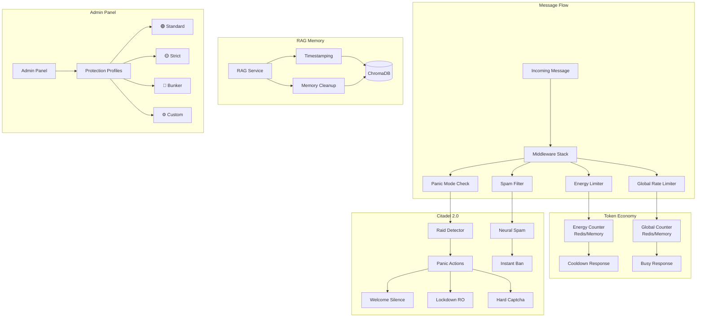

# Design Document: Project OLEG v6.5 (Shield & Economy)

## Overview

Project OLEG v6.5 расширяет существующую архитектуру бота системами экономии токенов LLM и усиленной защиты от рейдов. Обновление интегрируется с существующими сервисами (`citadel.py`, `security.py`, `redis_client.py`, `vector_db.py`) и добавляет новые компоненты для управления энергией пользователей, временной памятью RAG и профилями защиты.

## Architecture


```mermaid
graph TB
    subgraph "Message Flow"
        MSG[Incoming Message] --> MW[Middleware Stack]
        MW --> EL[Energy Limiter]
        MW --> GL[Global Rate Limiter]
        MW --> SF[Spam Filter]
        MW --> PM[Panic Mode Check]
    end
    
    subgraph "Token Economy"
        EL --> EC[Energy Counter<br/>Redis/Memory]
        GL --> GC[Global Counter<br/>Redis/Memory]
        EC --> CD[Cooldown Response]
        GC --> BR[Busy Response]
    end
    
    subgraph "Citadel 2.0"
        PM --> RD[Raid Detector]
        RD --> PA[Panic Actions]
        PA --> WS[Welcome Silence]
        PA --> LK[Lockdown RO]
        PA --> HC[Hard Captcha]
        SF --> NS[Neural Spam]
        NS --> BAN[Instant Ban]
    end
    
    subgraph "RAG Memory"
        RAG[RAG Service] --> TS[Timestamping]
        RAG --> MC[Memory Cleanup]
        TS --> CB[(ChromaDB)]
        MC --> CB
    end
    
    subgraph "Admin Panel"
        AP[Admin Panel] --> PP[Protection Profiles]
        PP --> STD[🟢 Standard]
        PP --> STR[🟡 Strict]
        PP --> BNK[🔴 Bunker]
        PP --> CST[⚙️ Custom]
    end
```

## Components and Interfaces

### 1. Energy Limiter Service (`app/services/energy_limiter.py`)

Управляет персональной "энергией" пользователей для общения с ботом.

```python
@dataclass
class UserEnergy:
    user_id: int
    chat_id: int
    energy: int  # 0-3
    last_request: datetime
    cooldown_until: Optional[datetime]

class EnergyLimiterService:
    async def check_energy(self, user_id: int, chat_id: int) -> Tuple[bool, Optional[str]]
    async def consume_energy(self, user_id: int, chat_id: int) -> None
    async def reset_energy(self, user_id: int, chat_id: int) -> None
    async def get_cooldown_remaining(self, user_id: int, chat_id: int) -> int
```

### 2. Global Rate Limiter Extension (`app/services/global_rate_limiter.py`)

Расширяет существующий `rate_limiter` для глобальных лимитов на чат.

```python
@dataclass
class ChatRateLimit:
    chat_id: int
    request_count: int
    window_start: datetime
    limit: int  # configurable, default 20

class GlobalRateLimiterService:
    async def check_chat_limit(self, chat_id: int) -> Tuple[bool, Optional[str]]
    async def increment_chat_counter(self, chat_id: int) -> None
    async def set_chat_limit(self, chat_id: int, limit: int) -> None
    async def get_chat_limit(self, chat_id: int) -> int
```

### 3. Status Notification Manager (`app/services/status_manager.py`)

Управляет статусными уведомлениями для предотвращения флуда.

```python
@dataclass
class ProcessingStatus:
    chat_id: int
    is_processing: bool
    pending_messages: List[int]  # message_ids with reactions

class StatusManager:
    async def start_processing(self, chat_id: int, message_id: int) -> bool
    async def add_pending_reaction(self, chat_id: int, message_id: int) -> None
    async def finish_processing(self, chat_id: int) -> None
    async def is_processing(self, chat_id: int) -> bool
```

### 4. RAG Temporal Memory Extension (`app/services/vector_db.py` extension)

Расширяет существующий `VectorDB` для временной памяти.

```python
class VectorDB:
    # Existing methods...
    
    # New methods for temporal memory
    def add_fact_with_timestamp(
        self, 
        collection_name: str, 
        fact_text: str, 
        metadata: Dict,
        created_at: Optional[datetime] = None
    ) -> str
    
    def search_facts_with_age(
        self,
        collection_name: str,
        query: str,
        chat_id: int,
        n_results: int = 5
    ) -> List[Dict]  # includes 'age_days' field
    
    def delete_old_facts(
        self,
        collection_name: str,
        chat_id: int,
        older_than_days: int = 90
    ) -> int  # returns count deleted
    
    def delete_user_facts(
        self,
        collection_name: str,
        chat_id: int,
        user_id: int
    ) -> int
    
    def delete_all_chat_facts(
        self,
        collection_name: str,
        chat_id: int
    ) -> int
```

### 5. Panic Mode Controller (`app/services/panic_mode.py`)

Расширяет `CitadelService` для автоматического Panic Mode.

```python
@dataclass
class PanicModeState:
    chat_id: int
    active: bool
    activated_at: Optional[datetime]
    trigger_reason: str  # "mass_join" | "message_flood"
    restricted_users: Set[int]

class PanicModeController:
    # Thresholds
    JOIN_THRESHOLD = 10  # joins per 10 seconds
    MESSAGE_THRESHOLD = 20  # messages per second
    
    async def check_join_trigger(self, chat_id: int) -> bool
    async def check_message_trigger(self, chat_id: int) -> bool
    async def activate_panic_mode(self, chat_id: int, reason: str) -> None
    async def deactivate_panic_mode(self, chat_id: int) -> None
    async def apply_lockdown(self, chat_id: int, bot: Bot) -> List[int]
    async def generate_hard_captcha(self) -> Tuple[str, str]  # (question, answer)
    async def verify_captcha(self, user_id: int, answer: str) -> bool
```

### 6. Bot Permission Checker (`app/services/permission_checker.py`)

Проверяет права бота перед модерационными действиями.

```python
@dataclass
class BotPermissions:
    chat_id: int
    can_delete_messages: bool
    can_restrict_members: bool
    can_ban_users: bool
    can_pin_messages: bool
    cached_at: datetime

class PermissionChecker:
    CACHE_TTL_SECONDS = 60
    
    async def check_permissions(self, chat_id: int, bot: Bot) -> BotPermissions
    async def can_perform_action(self, chat_id: int, action: str, bot: Bot) -> bool
    async def report_missing_permission(self, chat_id: int, action: str, bot: Bot) -> None
    def invalidate_cache(self, chat_id: int) -> None
```

### 7. Neural Spam Classifier (`app/services/spam_classifier.py`)

Классификатор спама на основе regex + keywords + scoring.

```python
@dataclass
class SpamClassification:
    is_spam: bool
    confidence: float
    matched_patterns: List[str]
    category: str  # "selling", "crypto", "job_offer", "collaboration"

class SpamClassifier:
    SPAM_PATTERNS: Dict[str, List[str]]  # category -> patterns
    
    def classify(self, text: str) -> SpamClassification
    def add_pattern(self, category: str, pattern: str) -> None
    def remove_pattern(self, category: str, pattern: str) -> None
```

### 8. New User Scanner (`app/services/user_scanner.py`)

Сканирует новых пользователей на подозрительность.

```python
@dataclass
class UserScanResult:
    user_id: int
    suspicion_score: float  # 0.0 - 1.0
    flags: List[str]  # ["no_avatar", "suspicious_name", "rtl_chars"]
    should_silent_ban: bool
    should_require_captcha: bool

class UserScanner:
    async def scan_user(self, user: User) -> UserScanResult
    def check_avatar(self, user: User) -> bool
    def check_name(self, name: str) -> Tuple[bool, List[str]]
    def check_premium(self, user: User) -> bool
    def calculate_score(self, flags: List[str]) -> float
```

### 9. Protection Profile Manager (`app/services/protection_profiles.py`)

Управляет профилями защиты чатов.

```python
class ProtectionProfile(Enum):
    STANDARD = "standard"
    STRICT = "strict"
    BUNKER = "bunker"
    CUSTOM = "custom"

@dataclass
class ProfileSettings:
    anti_spam_links: bool
    captcha_type: str  # "button" | "hard"
    profanity_allowed: bool
    neural_ad_filter: bool
    block_forwards: bool
    sticker_limit: int  # 0 = unlimited
    mute_newcomers: bool
    block_media_non_admin: bool
    aggressive_profanity: bool

PROFILE_PRESETS: Dict[ProtectionProfile, ProfileSettings] = {
    ProtectionProfile.STANDARD: ProfileSettings(
        anti_spam_links=True,
        captcha_type="button",
        profanity_allowed=True,
        neural_ad_filter=False,
        block_forwards=False,
        sticker_limit=0,
        mute_newcomers=False,
        block_media_non_admin=False,
        aggressive_profanity=False
    ),
    ProtectionProfile.STRICT: ProfileSettings(
        anti_spam_links=True,
        captcha_type="button",
        profanity_allowed=False,
        neural_ad_filter=True,
        block_forwards=True,
        sticker_limit=3,
        mute_newcomers=False,
        block_media_non_admin=False,
        aggressive_profanity=False
    ),
    ProtectionProfile.BUNKER: ProfileSettings(
        anti_spam_links=True,
        captcha_type="hard",
        profanity_allowed=False,
        neural_ad_filter=True,
        block_forwards=True,
        sticker_limit=0,
        mute_newcomers=True,
        block_media_non_admin=True,
        aggressive_profanity=True
    ),
}

class ProtectionProfileManager:
    async def get_profile(self, chat_id: int) -> Tuple[ProtectionProfile, ProfileSettings]
    async def set_profile(self, chat_id: int, profile: ProtectionProfile) -> None
    async def set_custom_settings(self, chat_id: int, settings: ProfileSettings) -> None
    async def get_settings(self, chat_id: int) -> ProfileSettings
```

## Data Models

### Database Extensions (`app/database/models.py`)

```python
class UserEnergy(Base):
    __tablename__ = "user_energy"
    
    id = Column(Integer, primary_key=True)
    user_id = Column(BigInteger, nullable=False)
    chat_id = Column(BigInteger, nullable=False)
    energy = Column(Integer, default=3)
    last_request = Column(DateTime(timezone=True))
    cooldown_until = Column(DateTime(timezone=True))
    
    __table_args__ = (
        UniqueConstraint('user_id', 'chat_id', name='uq_user_chat_energy'),
    )

class ChatRateLimitConfig(Base):
    __tablename__ = "chat_rate_limit_config"
    
    id = Column(Integer, primary_key=True)
    chat_id = Column(BigInteger, unique=True, nullable=False)
    llm_requests_per_minute = Column(Integer, default=20)
    updated_at = Column(DateTime(timezone=True), default=utc_now)

class ProtectionProfileConfig(Base):
    __tablename__ = "protection_profile_config"
    
    id = Column(Integer, primary_key=True)
    chat_id = Column(BigInteger, unique=True, nullable=False)
    profile = Column(String(20), default="standard")
    # Custom settings (used when profile="custom")
    anti_spam_links = Column(Boolean, default=True)
    captcha_type = Column(String(10), default="button")
    profanity_allowed = Column(Boolean, default=True)
    neural_ad_filter = Column(Boolean, default=False)
    block_forwards = Column(Boolean, default=False)
    sticker_limit = Column(Integer, default=0)
    mute_newcomers = Column(Boolean, default=False)
    block_media_non_admin = Column(Boolean, default=False)
    aggressive_profanity = Column(Boolean, default=False)
    updated_at = Column(DateTime(timezone=True), default=utc_now)

class SilentBan(Base):
    __tablename__ = "silent_bans"
    
    id = Column(Integer, primary_key=True)
    user_id = Column(BigInteger, nullable=False)
    chat_id = Column(BigInteger, nullable=False)
    reason = Column(String(255))
    captcha_answer = Column(String(50))  # Expected answer for unban
    created_at = Column(DateTime(timezone=True), default=utc_now)
    expires_at = Column(DateTime(timezone=True))
    
    __table_args__ = (
        UniqueConstraint('user_id', 'chat_id', name='uq_user_chat_silent_ban'),
    )
```

### RAG Fact Metadata Schema

```python
@dataclass
class RAGFactMetadata:
    """Metadata schema for RAG facts in ChromaDB."""
    chat_id: int
    user_id: int
    username: str
    topic_id: int  # -1 if not in topic
    message_id: int
    created_at: str  # ISO 8601 format
    
    def to_dict(self) -> Dict[str, Any]:
        return {
            "chat_id": self.chat_id,
            "user_id": self.user_id,
            "username": self.username,
            "topic_id": self.topic_id,
            "message_id": self.message_id,
            "created_at": self.created_at,
        }
    
    @classmethod
    def from_dict(cls, data: Dict[str, Any]) -> "RAGFactMetadata":
        return cls(
            chat_id=data["chat_id"],
            user_id=data["user_id"],
            username=data.get("username", ""),
            topic_id=data.get("topic_id", -1),
            message_id=data.get("message_id", 0),
            created_at=data["created_at"],
        )
```


## Correctness Properties

*A property is a characteristic or behavior that should hold true across all valid executions of a system-essentially, a formal statement about what the system should do. Properties serve as the bridge between human-readable specifications and machine-verifiable correctness guarantees.*

### Property 1: Energy Decrement on Rapid Requests
*For any* user with energy > 0 who sends a message within 10 seconds of their previous message, the energy counter SHALL be decremented by exactly 1.
**Validates: Requirements 1.1**

### Property 2: Cooldown Message Contains Required Elements
*For any* user with energy = 0, the cooldown response SHALL contain the user's mention and a 60-second wait instruction.
**Validates: Requirements 1.2**

### Property 3: Energy Reset After Inactivity
*For any* user who sends a message after 60+ seconds of inactivity, the energy counter SHALL be reset to 3.
**Validates: Requirements 1.3**

### Property 4: Energy Allows Processing
*For any* user with energy > 0, the request SHALL be allowed to proceed to LLM processing.
**Validates: Requirements 1.4**

### Property 5: Global Limit Exceeded Behavior
*For any* chat at or above the configured LLM request limit, new requests SHALL be rejected and the response SHALL be the cached message "Занят."
**Validates: Requirements 2.1, 2.2**

### Property 6: Rate Limit Window Reset
*For any* chat with any request counter value, after 60 seconds the counter SHALL be reset to 0.
**Validates: Requirements 2.4**

### Property 7: Processing State Triggers Reaction
*For any* chat in processing state, new incoming messages SHALL receive a reaction (⏳) instead of status notifications.
**Validates: Requirements 3.1**

### Property 8: First Request Triggers Notification
*For any* chat not in processing state, the first request SHALL trigger exactly one status notification.
**Validates: Requirements 3.2**

### Property 9: RAG Fact Timestamp Presence
*For any* fact saved to ChromaDB, the metadata SHALL include a created_at field in valid ISO 8601 format.
**Validates: Requirements 4.1**

### Property 10: RAG Prompt Contains Current DateTime
*For any* RAG response generation, the prompt SHALL contain the current date and time in format "СЕГОДНЯ: YYYY-MM-DD HH:MM".
**Validates: Requirements 4.2**

### Property 11: RAG Fact Prioritization by Recency
*For any* set of facts with conflicting information on the same topic, the fact with the most recent created_at timestamp SHALL be prioritized.
**Validates: Requirements 4.3**

### Property 12: Memory Deletion Completeness - All Facts
*For any* chat with facts, after "forget all" operation, the chat SHALL have exactly 0 facts in ChromaDB.
**Validates: Requirements 5.1**

### Property 13: Memory Deletion Completeness - Old Facts
*For any* chat after "forget old" operation, no facts with created_at older than 90 days SHALL remain.
**Validates: Requirements 5.2**

### Property 14: Memory Deletion Completeness - User Facts
*For any* user in a chat after "forget user" operation, no facts associated with that user_id SHALL remain in that chat.
**Validates: Requirements 5.3**

### Property 15: Deletion Count Accuracy
*For any* memory deletion operation, the returned count SHALL equal the actual number of facts deleted.
**Validates: Requirements 5.4**

### Property 16: Panic Mode Activation on Mass Join
*For any* sequence of 10+ user joins within 10 seconds, Panic_Mode SHALL be activated.
**Validates: Requirements 6.1**

### Property 17: Panic Mode Activation on Message Flood
*For any* sequence of 20+ messages per second from different users, Panic_Mode SHALL be activated.
**Validates: Requirements 6.2**

### Property 18: Panic Mode Silences Welcome Messages
*For any* new user join while Panic_Mode is active, no welcome message SHALL be sent.
**Validates: Requirements 6.3**

### Property 19: Panic Mode Restricts Recent Users
*For any* user who joined within the last 24 hours while Panic_Mode is active, RO status SHALL be applied for 30 minutes.
**Validates: Requirements 6.4**

### Property 20: Permission Check Before Moderation
*For any* moderation action (mute/ban/delete), the bot's permissions SHALL be verified via get_chat_member before execution.
**Validates: Requirements 7.1**

### Property 21: Missing Permission Silent Report
*For any* moderation action where the bot lacks required permissions, a silent report SHALL be sent to administrators.
**Validates: Requirements 7.2**

### Property 22: No Threats Without Permissions
*For any* moderation scenario where the bot lacks permissions, no threatening messages SHALL be sent to violators.
**Validates: Requirements 7.3**

### Property 23: Spam Detection Triggers Delete and Ban
*For any* message matching spam patterns, the message SHALL be deleted AND the sender SHALL be banned.
**Validates: Requirements 8.1, 8.2**

### Property 24: Spam Classification Logging
*For any* message classified as spam, the log SHALL contain the message content hash and classification confidence.
**Validates: Requirements 8.4**

### Property 25: New User Scan Checks All Factors
*For any* new user joining, the scan SHALL check: presence of profile photo, username for suspicious patterns (RTL, hieroglyphics, spam words), and Premium status.
**Validates: Requirements 9.1, 9.2, 9.3**

### Property 26: High Suspicion Score Triggers Silent Ban
*For any* user with suspicion score exceeding threshold (no avatar + suspicious name), Silent_Ban SHALL be applied.
**Validates: Requirements 9.4**

### Property 27: Silent Ban Deletes Messages Silently
*For any* message from a user under Silent_Ban, the message SHALL be deleted without notification.
**Validates: Requirements 9.5**

### Property 28: Protection Profile Applies Correct Settings
*For any* protection profile selection (Standard/Strict/Bunker), the corresponding settings SHALL be applied:
- Standard: anti_spam_links=true, captcha_type="button", profanity_allowed=true
- Strict: neural_ad_filter=true, block_forwards=true, sticker_limit=3
- Bunker: mute_newcomers=true, block_media_non_admin=true, aggressive_profanity=true
**Validates: Requirements 10.1, 10.2, 10.3**

### Property 29: RAG Fact Serialization Round-Trip
*For any* RAG fact with metadata (chat_id, user_id, username, topic_id, message_id, created_at), serializing to JSON and deserializing SHALL produce an equivalent object with identical field values.
**Validates: Requirements 11.1, 11.2**

### Property 30: Unicode Preservation in Serialization
*For any* RAG fact containing Unicode characters (Cyrillic, emoji, special symbols), the round-trip serialization SHALL preserve all characters exactly.
**Validates: Requirements 11.3**

## Error Handling

### Energy Limiter Errors
- Redis unavailable: Fall back to in-memory storage with warning log
- Database error on energy read: Allow request (fail-open for UX)
- Invalid user_id/chat_id: Return error tuple with descriptive message

### RAG Memory Errors
- ChromaDB connection failure: Log error, skip RAG context in response
- Invalid metadata format: Skip fact, log warning with fact_id
- Deletion failure: Return partial count, log failed deletions

### Panic Mode Errors
- Bot lacks restrict permissions: Log warning, skip restriction, notify admins
- Captcha generation failure: Fall back to simple button captcha
- Rate limit on Telegram API: Queue actions with exponential backoff

### Spam Classifier Errors
- Pattern compilation failure: Skip invalid pattern, log error
- Classification timeout: Allow message (fail-open), log warning

### Permission Checker Errors
- API timeout: Use cached permissions if available, else assume no permissions
- Invalid chat_id: Return empty permissions object

## Testing Strategy

### Property-Based Testing Framework
- **Library**: Hypothesis (Python)
- **Minimum iterations**: 100 per property test
- **Tag format**: `**Feature: shield-economy-v65, Property {number}: {property_text}**`

### Unit Tests
Unit tests will cover:
- Edge cases for energy boundaries (0, 3, negative)
- Timestamp parsing and formatting
- Spam pattern matching accuracy
- Profile settings serialization

### Property-Based Tests
Each correctness property (1-30) will have a corresponding property-based test that:
1. Generates random valid inputs using Hypothesis strategies
2. Executes the system under test
3. Verifies the property holds for all generated inputs

### Test Organization
```
tests/
├── property/
│   ├── test_energy_limiter_props.py      # Properties 1-4
│   ├── test_global_rate_limit_props.py   # Properties 5-6
│   ├── test_status_manager_props.py      # Properties 7-8
│   ├── test_rag_temporal_props.py        # Properties 9-15
│   ├── test_panic_mode_props.py          # Properties 16-19
│   ├── test_permission_checker_props.py  # Properties 20-22
│   ├── test_spam_classifier_props.py     # Properties 23-24
│   ├── test_user_scanner_props.py        # Properties 25-27
│   ├── test_protection_profiles_props.py # Property 28
│   └── test_rag_serialization_props.py   # Properties 29-30
└── unit/
    ├── test_energy_limiter.py
    ├── test_spam_patterns.py
    └── test_profile_settings.py
```

### Integration Tests
- End-to-end flow: User sends message → energy check → rate limit check → response
- Panic mode activation → restriction application → captcha verification → unmute
- Admin panel: Profile selection → settings application → verification
